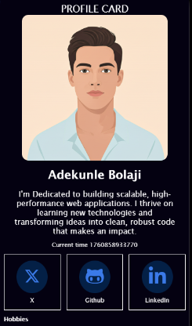

# HNG Internship - Stage 0: Profile Card Component

A responsive and accessible user profile card developed as part of the HNG Internship Stage 0 challenge. This project showcases a clean, modern profile interface built entirely with HTML, CSS, and vanilla JavaScript, emphasizing semantic structure and comprehensive testability.

## ✨ Live Demo

View the deployed project: [https://your-project-name.netlify.app/](https://your-project-name.netlify.app/)

## 📸 Preview




## 🚀 Key Features

-   **Semantic Markup**: Utilizes proper HTML5 elements including `<article>`, `<figure>`, `<nav>`, and `<section>` to enhance accessibility and search engine optimization.
-   **Adaptive Design**: Seamlessly adjusts across all device sizes—mobile phones, tablets, and desktop screens—using CSS Flexbox for flexible layouts.
-   **Test-Driven Structure**: All critical elements are tagged with `data-testid` attributes, enabling straightforward automated testing integration.
-   **Live Clock Feature**: Displays real-time milliseconds using JavaScript's `Date.now()`, with automatic updates every second via `setInterval()`.
-   **Keyboard Accessible**: Complete keyboard navigation support with visible focus indicators for an inclusive user experience.
-   **Smooth Animations**: Engaging skeleton loading effects and hover transitions for enhanced visual appeal.

## 🛠️ Built With

-   **HTML5**: Semantic structure and content organization
-   **CSS3**: Modern styling, animations, and responsive layouts
-   **JavaScript (ES6)**: Dynamic time updates and interactivity
-   **Font Awesome**: SVG icons for social media links

## 📂 Project Structure

```
profile-card/
├── index.html          # Main HTML document
├── style.css           # Stylesheet with responsive design
├── script.js           # JavaScript for dynamic features
├── bigJesus.png        # Profile avatar image
├── README.md           # Project documentation
└── screenshot.png      # Preview image
```

## ⚙️ Local Development Setup

No dependencies or build tools required! Follow these straightforward steps to run the project locally:

### 1. Clone the Repository

```bash
git clone https://github.com/beejayofgod/hng-stage-0-profile-card.git
```

### 2. Navigate to Project Folder

```bash
cd hng-stage-0-profile-card
```

### 3. Launch in Browser

**Option A**: Simply double-click `index.html` in your file explorer

**Option B**: Right-click `index.html` → "Open with" → Choose your preferred browser

**Option C** (Recommended): Use a local development server

```bash
# Using Python
python -m http.server 8000

# Using Node.js
npx serve

# Using PHP
php -S localhost:8000
```

Then navigate to `http://localhost:8000` in your browser.

That's all! Your profile card should now be running locally. 🎉

## ✅ Requirements Fulfilled

### Core Elements

-   [x] Profile card container (`test-profile-card`)
-   [x] User name display (`test-user-name`)
-   [x] Biography section (`test-user-bio`)
-   [x] Real-time millisecond clock (`test-user-time`)
-   [x] Profile avatar image (`test-user-avatar`)
-   [x] Social media links (`test-user-social-links`)
-   [x] Individual platform links (Twitter, GitHub, LinkedIn)
-   [x] Hobbies listing (`test-user-hobbies`)
-   [x] Dislikes listing (`test-user-dislikes`)

### Technical Standards

-   [x] Semantic HTML5 structure
-   [x] Mobile-first responsive design
-   [x] WCAG accessibility compliance
-   [x] Keyboard navigation support
-   [x] External links with security attributes
-   [x] Proper ARIA labels

## 🎨 Design Highlights

-   **Color Palette**: Deep navy background (`#040111`) with vibrant blue accents (`#3b7ae8`)
-   **Typography**: Lucida Sans family for clean, professional readability
-   **Animations**: Subtle border color transitions for visual interest
-   **Layout**: Flexible box model ensuring content adapts gracefully

## 🧪 Testing

The project includes comprehensive `data-testid` attributes for automated testing:

```javascript
// Example test queries
document.querySelector('[data-testid="test-profile-card"]');
document.querySelector('[data-testid="test-user-name"]');
document.querySelector('[data-testid="test-user-time"]');
```

### Browser Compatibility

Tested and verified on:

-   ✅ Google Chrome (latest)
-   ✅ Mozilla Firefox (latest)
-   ✅ Safari (latest)
-   ✅ Microsoft Edge (latest)

## 👨‍💻 Author

**Adekunle Bolaji**

-   Twitter: [@beejayofgod](https://twitter.com/beejayofgod)
-   GitHub: [@beejayofgod](https://github.com/beejayofgod)
-   LinkedIn: [beejayofgod](https://linkedin.com/in/beejayofgod)

## 📝 License

This project is part of the HNG Internship program.

## 🔗 Useful Links

-   [HNG Internship Program](https://hng.tech/internship)
-   [HNG Premium Services](https://hng.tech/premium)
-   [Hire HNG Developers](https://hng.tech/hire)

---

**Submission Date**: October 19, 2025
**Track**: Frontend Development
**Stage**: 0
