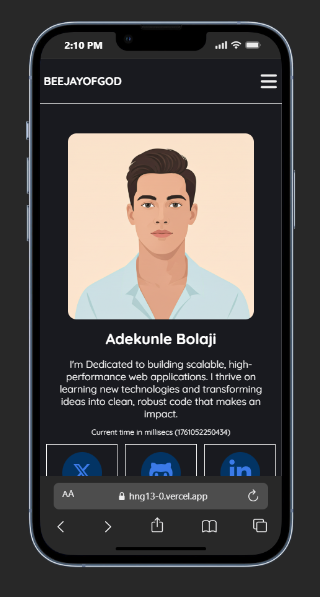
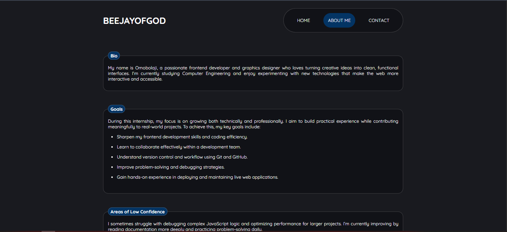

# HNG Internship - Stage 1: Multi-Page Profile Application

A comprehensive, multi-page responsive web application developed as part of the HNG Internship Stage 1 challenge. This project extends the Stage 0 profile card with two additional pages: a fully validated Contact Us form and a reflective About Me page. Built with semantic HTML, accessible design principles, and vanilla JavaScript for robust form validation.

## ✨ Live Demo

View the deployed project: [https://hng13-1.vercel.app/](https://hng13-0.vercel.app/)

## 📸 Preview





## 🚀 Key Features

### Core Features (From Stage 0)
-   **Semantic Markup**: Utilizes proper HTML5 elements including `<article>`, `<figure>`, `<nav>`, and `<section>` for enhanced accessibility and SEO
-   **Adaptive Design**: Seamlessly adjusts across all device sizes using CSS Flexbox and Grid
-   **Live Clock Feature**: Displays real-time milliseconds with automatic updates
-   **Keyboard Accessible**: Complete keyboard navigation support with visible focus indicators

### New Features (Stage 1)
-   **Contact Form with Validation**: Client-side validation with comprehensive error handling and user feedback
-   **About Me Page**: Reflective content showcasing personal journey and program goals
-   **Multi-Page Navigation**: Seamless routing between profile, contact, and about pages
-   **Enhanced Accessibility**: ARIA labels, error associations, and semantic form structure
-   **Success Notifications**: Real-time feedback for successful form submissions

## 🛠️ Built With

-   **HTML5**: Semantic structure and content organization
-   **CSS3**: Modern styling, animations, responsive layouts, and CSS Grid
-   **JavaScript (ES6)**: Form validation logic, dynamic updates, and interactivity
-   **Font Awesome**: SVG icons for social media links and UI elements

## 📂 Project Structure

```
profile-application/
├── index.html              # Main profile card page (Stage 0)
├── contact.html            # Contact Us page with form validation
├── about.html              # About Me reflective page
├── css/
│   ├── style.css          # Global styles and profile card styles
│   ├── contact.css        # Contact page specific styles
│   ├── about.css          # About page specific styles
|   └── navbar.css
├── js/
│   ├── script.js          # Main JavaScript (clock functionality)
|   ├── activeLink.js      # hamburger toggling on mobile
│   └── contact.js         # Form validation logic
├── assets/
│   ├── bigJesus.png       # Profile avatar image
│   └── screenshots/       # Application previews
├── README.md              # Project documentation
└── .gitignore             # Git ignore file
```

## ⚙️ Local Development Setup

No dependencies or build tools required! Follow these steps:

### 1. Clone the Repository

```bash
git clone https://github.com/beejayofgod/hng-stage-1-multipage.git
```

### 2. Navigate to Project Folder

```bash
cd hng-stage-1-multipage
```

### 3. Launch in Browser

**Option A**: Double-click `index.html` in your file explorer

**Option B**: Right-click `index.html` → "Open with" → Choose your browser

**Option C** (Recommended): Use a local development server

```bash
# Using Python
python -m http.server 8000

# Using Node.js
npx serve

# Using PHP
php -S localhost:8000
```

Navigate to `http://localhost:8000` in your browser.

## 📄 Page Descriptions

### 1. Profile Card (index.html)
The original Stage 0 profile card featuring:
- Real-time millisecond clock
- Personal biography
- Social media links
- Hobbies and dislikes sections

### 2. Contact Us Page (contact.html)
A fully functional contact form with:
- **Full Name field** (`test-contact-name`)
- **Email field** (`test-contact-email`)
- **Subject field** (`test-contact-subject`)
- **Message textarea** (`test-contact-message`)
- **Submit button** (`test-contact-submit`)
- Real-time field validation on blur
- Comprehensive error messages (`test-contact-error-*`)
- Success notification (`test-contact-success`)

**Validation Rules:**
- All fields required
- Email must match standard format (name@example.com)
- Message minimum 10 characters
- Subject minimum 3 characters
- Name minimum 2 characters

### 3. About Me Page (about.html)
A reflective page containing:
- **Biography** (`test-about-bio`) - Personal background and journey
- **Program Goals** (`test-about-goals`) - Objectives for HNG Internship
- **Areas of Low Confidence** (`test-about-confidence`) - Honest self-assessment
- **Note to Future Self** (`test-about-future-note`) - Motivational message
- **Extra Thoughts** (`test-about-extra`) - Additional reflections

## ✅ Requirements Fulfilled

### Contact Us Page
-   [x] Full name input with validation (`test-contact-name`)
-   [x] Email input with format validation (`test-contact-email`)
-   [x] Subject input with validation (`test-contact-subject`)
-   [x] Message textarea with minimum length (`test-contact-message`)
-   [x] Submit button (`test-contact-submit`)
-   [x] Field-specific error messages (`test-contact-error-name`, etc.)
-   [x] Success confirmation message (`test-contact-success`)
-   [x] All inputs have linked `<label>` elements
-   [x] Error messages use `aria-describedby`
-   [x] Full keyboard accessibility
-   [x] Real-time validation on blur
-   [x] Error clearing on input

### About Me Page
-   [x] Main container (`test-about-page`)
-   [x] Biography section (`test-about-bio`)
-   [x] Goals section (`test-about-goals`)
-   [x] Confidence areas section (`test-about-confidence`)
-   [x] Future note section (`test-about-future-note`)
-   [x] Extra thoughts section (`test-about-extra`)
-   [x] Semantic HTML structure (main, section, headings)
-   [x] Proper heading hierarchy (h1, h2, h3)

### General Requirements
-   [x] Semantic HTML5 throughout all pages
-   [x] WCAG accessibility compliance
-   [x] Mobile-first responsive design
-   [x] Keyboard navigation support
-   [x] External links with security attributes
-   [x] Consistent styling and branding
-   [x] Modular, readable code structure

## 🎨 Design Highlights

-   **Color Palette**: Deep navy background (`#040111`) with vibrant blue accents (`#3b7ae8`)
-   **Typography**: Lucida Sans family for professional readability
-   **Form Design**: Clean, accessible inputs with clear error states
-   **Animations**: Smooth transitions and focus indicators
-   **Layout**: Responsive grid/flexbox ensuring optimal viewing on all devices

## 🧪 Testing

### Form Validation Testing

Test the contact form validation:

```javascript
// All required fields
document.querySelector('[data-testid="test-contact-name"]');
document.querySelector('[data-testid="test-contact-email"]');
document.querySelector('[data-testid="test-contact-subject"]');
document.querySelector('[data-testid="test-contact-message"]');
document.querySelector('[data-testid="test-contact-submit"]');

// Error messages
document.querySelector('[data-testid="test-contact-error-name"]');
document.querySelector('[data-testid="test-contact-error-email"]');
document.querySelector('[data-testid="test-contact-error-subject"]');
document.querySelector('[data-testid="test-contact-error-message"]');

// Success message
document.querySelector('[data-testid="test-contact-success"]');
```

### About Page Testing

```javascript
// Main container
document.querySelector('[data-testid="test-about-page"]');

// Content sections
document.querySelector('[data-testid="test-about-bio"]');
document.querySelector('[data-testid="test-about-goals"]');
document.querySelector('[data-testid="test-about-confidence"]');
document.querySelector('[data-testid="test-about-future-note"]');
document.querySelector('[data-testid="test-about-extra"]');
```

### Browser Compatibility

Tested and verified on:

-   ✅ Google Chrome (latest)
-   ✅ Mozilla Firefox (latest)
-   ✅ Safari (latest)
-   ✅ Microsoft Edge (latest)

### Accessibility Testing

-   ✅ Keyboard navigation (Tab, Enter, Space)
-   ✅ Screen reader compatibility (NVDA, JAWS)
-   ✅ Focus indicators visible
-   ✅ Color contrast ratios meet WCAG AA standards
-   ✅ Form labels properly associated
-   ✅ Error messages announced to assistive technologies

## 🎯 Validation Features

### Client-Side Validation
-   **Real-time feedback**: Errors display on field blur
-   **Inline clearing**: Errors disappear when user starts typing
-   **Focus management**: Auto-focus on first invalid field
-   **Comprehensive checks**: Email format, minimum lengths, required fields
-   **Success handling**: Clear form and show confirmation message

### Accessibility Features
-   **ARIA attributes**: `aria-invalid`, `aria-describedby`, `aria-live`
-   **Semantic labels**: All inputs properly labeled with `for` attribute
-   **Error association**: Errors linked to inputs via IDs
-   **Keyboard accessible**: All interactions work without mouse

## 👨‍💻 Author

**Adekunle Bolaji**

-   Twitter: [@beejayofgod](https://twitter.com/beejayofgod)
-   GitHub: [@beejayofgod](https://github.com/beejayofgod)
-   LinkedIn: [beejayofgod](https://linkedin.com/in/beejayofgod)
-   Portfolio: [Coming Soon]

## 📝 License

This project is part of the HNG Internship program.

## 🔗 Useful Links

-   [HNG Internship Program](https://hng.tech/internship)
-   [HNG Premium Services](https://hng.tech/premium)
-   [Hire HNG Developers](https://hng.tech/hire)

## 📚 Resources Used

-   [MDN: Semantic HTML & Accessibility](https://developer.mozilla.org/en-US/docs/Learn/Accessibility/HTML)
-   [MDN: Form Validation](https://developer.mozilla.org/en-US/docs/Learn/Forms/Form_validation)
-   [W3C: Accessible Forms Tutorial](https://www.w3.org/WAI/tutorials/forms/)
-   [CSS-Tricks: Responsive Design](https://css-tricks.com/snippets/css/media-queries-for-standard-devices/)

## 🚀 Future Enhancements

-   [ ] Backend integration for form submissions
-   [ ] Email service integration (SendGrid, EmailJS)
-   [ ] Form data persistence in localStorage
-   [ ] Dark/light theme toggle
-   [ ] Multi-language support
-   [ ] Enhanced animations and micro-interactions

---

**Submission Date**: October 22, 2025
**Track**: Frontend Development
**Stage**: 1
**Status**: ✅ Completed
